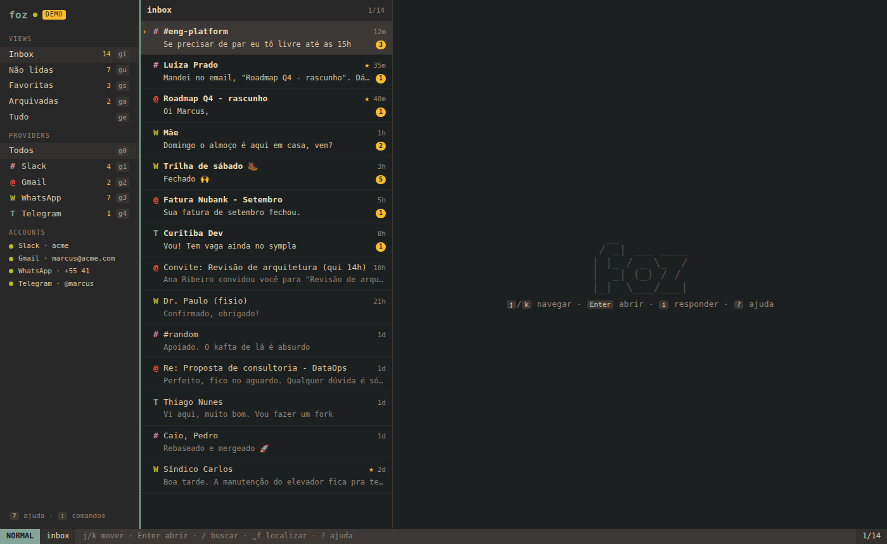
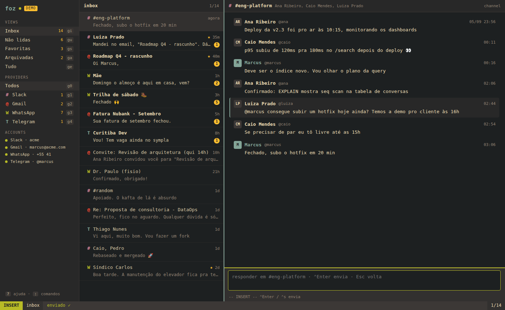

# foz

**Foz** (pt: *river mouth*, where all streams meet the sea) is a keyboard-first,
vim-modal unified inbox. Slack, Gmail and friends land in one list, one thread
pane and one composer, so you stop juggling five apps to talk to people.



- **One inbox** across providers, sorted by activity, with unread/star/archive.
- **Vim everywhere**: `j`/`k`, `gg`/`G`, counts (`3j`), chords (`gi`, `dd`),
  `<Leader>` (space), `/` search, `:` commands, a Telescope-style finder on
  `<C-p>`, and a statusline that says `NORMAL` / `INSERT` / `COMMAND`.
- **Remappable** from `foz.keymap.json` or at runtime with `:map` / `:unmap`.
- **Live**: a WebSocket pushes new messages into the open thread and statusline.
- **Zero-credential start**: with nothing configured Foz boots a demo provider
  that looks like Slack + Gmail + WhatsApp + Telegram, answers what you send,
  and (optionally) trickles in new messages.

## Quick start

```bash
pnpm install
pnpm dev          # server on :4321 (demo data) + Vite UI on :5173
```

Open http://localhost:5173 and press `?`.

Production-ish:

```bash
pnpm build && pnpm start   # single process on http://localhost:4321
```

## Connect real accounts

Everything is optional; see [`.env.example`](.env.example) and
[docs/PROVIDERS.md](docs/PROVIDERS.md).

| Provider | How | Notes |
| --- | --- | --- |
| Slack | `FOZ_SLACK_TOKEN=xoxp-…` (`pnpm foz auth slack` prints the scopes) | User token: you post as you. Polling, no Socket Mode app needed. |
| Gmail | `pnpm foz auth gmail --client-id … --client-secret …` | OAuth loopback flow; saves `data/gmail-credentials.json`. |
| Demo | on by default when no real account exists; force with `FOZ_DEMO=1` | `FOZ_DEMO_LIVE=0` disables random incoming messages. |

Once a real account exists the demo switches itself off (unless `FOZ_DEMO=1`).

## Keys (the short version)

| Keys | Action |
| --- | --- |
| `j` `k` `gg` `G` `<C-d>` `<C-u>` | move (list, thread messages or sidebar, depending on focus) |
| `h` `l` | focus pane left / right (`l` on a row opens it) |
| `Enter` | open conversation · `J` / `K` open next / previous |
| `i` `r` `a` | reply (INSERT mode) · `<C-Enter>` / `<C-s>` send · `Esc` back |
| `c` | compose: fuzzy-pick a conversation and start typing |
| `e` `dd` | archive · `u` toggle unread · `s` star · `x` select · `V` select all |
| `yy` | yank message text (thread) or link/title (list) |
| `gi` `gu` `gs` `ga` `ge` | inbox · unread · starred · archived · everything |
| `g0`…`g5` `Tab` `S-Tab` | provider filter |
| `/` `n` `N` | search (live) · next / prev result |
| `:` | command line (`:sync`, `:map`, `:archive`, `:q`, `Tab` completes) |
| `<Space>f` `<C-p>` | finder · `<Space>b` sidebar · `<Space>r` sync · `?` help |

Full list: [docs/KEYBINDINGS.md](docs/KEYBINDINGS.md), or press `?` in the app.



## Layout

```
packages/core     domain types + the vim keymap engine (pure TS, tested)
apps/server       Hono API + WebSocket, SQLite store, sync engine, providers
apps/web          React UI: three panes, statusline, finder, help
foz.keymap.json   your overrides (leader, bindings, unbind)
scripts/e2e.mjs   keyboard-driven Playwright smoke test
```

See [docs/ARCHITECTURE.md](docs/ARCHITECTURE.md).

## Scripts

```bash
pnpm dev         # server + Vite with HMR
pnpm build       # build the UI into apps/web/dist
pnpm start       # serve API + built UI on :4321
pnpm test        # vitest: keymap engine, store, sync, gmail parsing
pnpm typecheck   # tsc across the workspace
pnpm e2e         # Playwright keyboard tour against a running demo server
pnpm foz status  # what is configured
```

## Roadmap after V0

- WhatsApp (Baileys) and Telegram (GramJS) adapters using the same interface.
- Slack Socket Mode / Gmail push for sub-second delivery.
- New emails / new DMs to people not yet in a conversation.
- Rich email bodies, inline images, attachment download.
- Undo (`u` for real), snooze, and per-provider notification rules.
